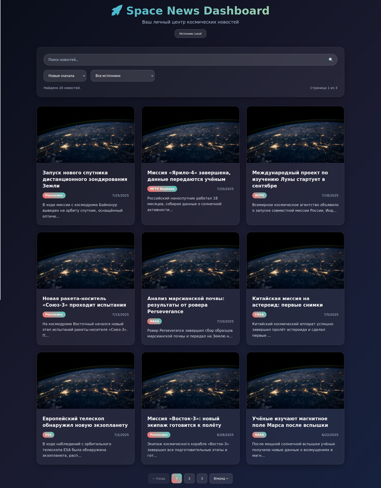

# 🚀 Space News Dashboard

Интерактивный дашборд для отображения космических новостей. Проект позволяет просматривать, искать, сортировать и фильтровать статьи о космосе из файла `data.json` или онлайн-источников (например, SpaceFlight News API).

## 📌 Цель проекта

Создать современный, отзывчивый и удобный веб-интерфейс для просмотра новостей из космоса с функциями поиска, фильтрации, сортировки и подробного просмотра статей.

---

## 📁 Структура проекта

```
space-news-dashboard/
├── index.html
├── css/
│   └── styles.css
├── js/
│   ├── main.js       // логика интерфейса
│   ├── data.js       // загрузка и фильтрация данных
│   ├── rawData.js    // Заглушка данных (JSON массив статей)
│   └── utils.js      // вспомогательные функции
├── assets/
│   └── images/       // картинки (если есть)
├── data.json         // локальный источник новостей
└── README.md
```

---

## 🧠 Основной функционал

* 🔄 Переключение между `API` и `Local` (rawData)
* 🔍 Поиск по заголовкам
* 🗃️ Фильтрация по источникам
* 🔢 Сортировка по дате публикации
* 📄 Пагинация (постраничный вывод)
* 🛰️ Модальные окна с подробной информацией о статье
* 🕹️ Адаптивный интерфейс
* 🛡️ Обработка ошибок и пустых данных

---

## 🧪 Используемые технологии

* HTML5 / CSS3 (Flexbox, Grid, media queries)
* Vanilla JavaScript (ES6+)
* Fetch API (для загрузки данных)
* [SpaceFlight News API](https://api.spaceflightnewsapi.net/v4/docs/#/) *(опционально)*

---

## Быстрый запуск (JS)

```bash
git clone https://platform.alem.school/git/zhkairbek/my-js-crunch-02.git
cd my-js-crunch-02
python3 -m http.server 8000
```
После открой браузер и перейди по адресу http://localhost:8000

---

## 🔁 Переключение источника данных

В правом верхнем углу интерфейса доступна кнопка Источник: API/Local — она переключает режим работы между:

API — данные загружаются с https://api.spaceflightnewsapi.net/v4/articles
Local — используется встроенный rawData.js
По умолчанию используется Local (можно изменить в data.js, строка let useAPI = false;).

## 🧪 Пример статьи в rawData
```js
{
   id: 12345,
   title: "Заголово",
   url: "ссылка на оригинал новости",
   image_url: "assets/images/ссылка_на_изображение.png",
   news_site: "Издатель новости",
   summary: "краткое описание...",
   content: "полное описание",
   published_at: "2025-07-25T12:00:00Z - дата и время выпуска",
   updated_at: "2025-07-25T12:00:00Z - дата и время обновления",
}
```

---

## 📸 Примеры интерфейса



---

## 👨‍🚀 Авторы

Разработано в рамках задания **JS Crunch 02**
- `zhkuandyk` - Жанель 
- `zhkairbek` - Жанат

---
